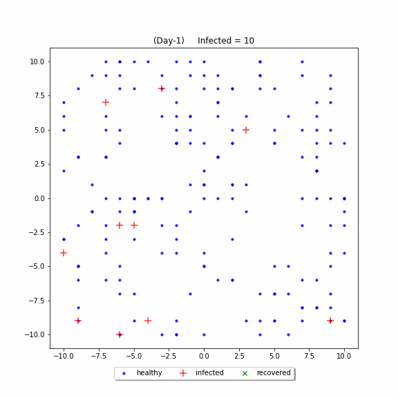

# Virus Spread
### Simulate The Spread of Virus/Disease (Random Walk)
Setiap individu direpresentasikan sebagai partikel yang bergerak bebas secara acak. 

Simulasi menghitung jumlah individu terinfeksi dan sembuh setiap harinya.

Proses berakhir setelah tidak ada lagi individu yang terinfeksi.

